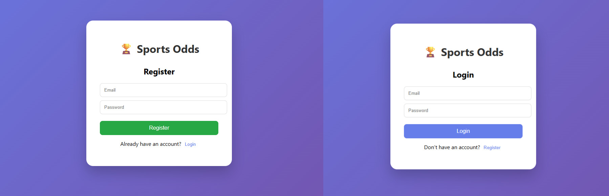
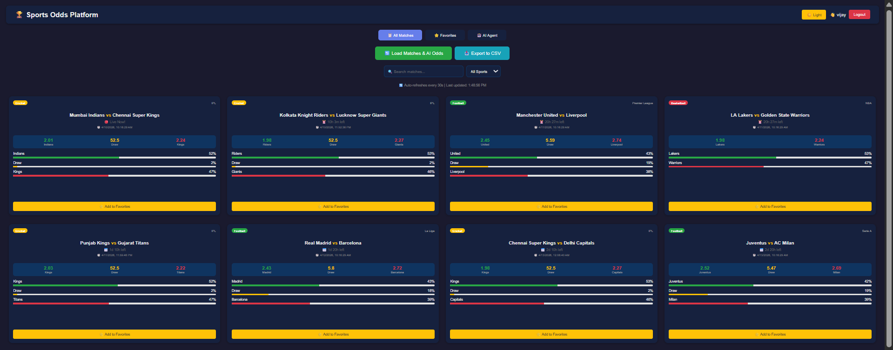
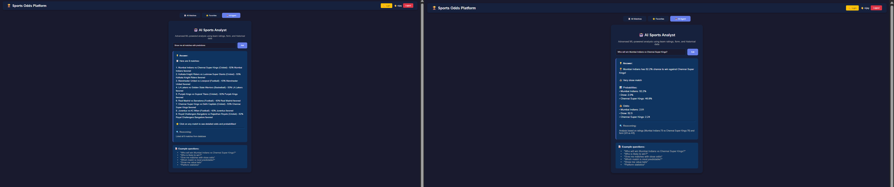
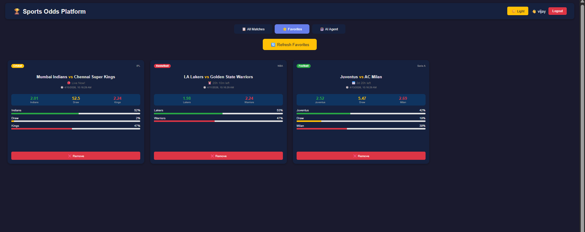
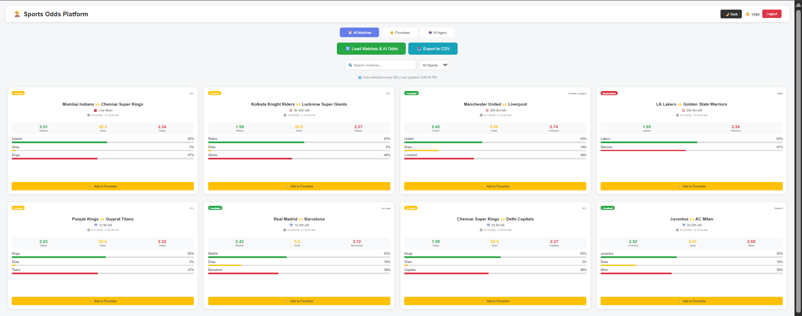

# 🏆 Sports Odds Intelligence Platform

<div align="center">


**An intelligent sports odds platform that generates dynamic odds using AI/ML models for Football, Cricket, and Basketball.**

</div>

---

## 📸 Screenshots

### 🔐 Authentication (Login & Register)
<div align="center">
  <a href="./images/auth.jpg">
    
  </a>
  <br/>
  <sub>Click image to view full size - Shows both Login and Register forms</sub>
</div>

---

### 📋 Matches Dashboard
<div align="center">
  <a href="./images/matches.png">
    
  </a>
  <br/>
  <sub>Click image to view full size</sub>
</div>

---

### 🤖 AI Agent
<div align="center">
  <a href="./images/ai-agent.jpg">
    
  </a>
  <br/>
  <sub>Click image to view full size</sub>
</div>

---

### ⭐ Favorites Page
<div align="center">
  <a href="./images/favorites.png">
    
  </a>
  <br/>
  <sub>Click image to view full size</sub>
</div>

---

### ☀️ Light Mode (Default)
<div align="center">
  <a href="./images/Light-mode.png">
    
  </a>
  <br/>
  <sub>Click image to view full size</sub>
</div>


---

## 🚀 Quick Start

### Prerequisites
- Node.js 18+
- Python 3.10+
- PostgreSQL 15+

### Installation

#### 1. Python Service (Port 8000)
```bash
cd python-service
pip install fastapi uvicorn
uvicorn main:app --reload --port 8000
```

## Backend (Port 5000)
```bash
cd backend
npm install
node index.js
```

## Frontend (Port 3000)

```bash
cd frontend
npm install
npm start
```

## Access Application

Frontend: http://localhost:3000  
Backend API: http://localhost:5000  
Python Service: http://localhost:8000


## 🔧 Environment Variables

### Backend (.env file)

```env
DB_USER=postgres
DB_PASSWORD=your_password
DB_NAME=sports_odds
DB_HOST=localhost
DB_PORT=5432
JWT_SECRET=your_super_secret_key_here
PORT=5000
PYTHON_SERVICE_URL=http://localhost:8000
```

## 📚 API Documentation

### Authentication

| Method | Endpoint   | Description        |
|--------|-----------|--------------------|
| POST   | /register | Register new user  |
| POST   | /login    | Login user         |

### Matches

| Method | Endpoint        | Description                     |
|--------|----------------|---------------------------------|
| GET    | /matches       | Get all matches with odds       |
| GET    | /favorites     | Get favorite matches            |
| POST   | /favorites     | Add to favorites                |
| DELETE | /favorites/:id | Remove from favorites           |

### AI Agent

| Method | Endpoint      | Description              |
|--------|--------------|--------------------------|
| POST   | /agent/query | Ask AI agent questions   |

### Python ML Service

| Method | Endpoint               | Description                          |
|--------|------------------------|--------------------------------------|
| POST   | /generate-odds        | Generate odds for single match       |
| POST   | /generate-odds-batch  | Generate odds for multiple matches   |
| GET    | /health               | Health check                         |

---

## 🤖 AI Agent Examples

| Question                              | What it does                      |
|---------------------------------------|----------------------------------|
| "Will Real Madrid win?"               | Predicts match outcome           |
| "Show me all matches"                 | Lists all matches                |
| "Who is the favorite?"                | Finds strongest favorite         |
| "Show me close matches"               | Finds competitive games          |
| "Which match is most predictable?"    | Safest bet                       |
| "Show me value bets"                  | Best underdog odds               |
| "Platform statistics"                 | Overall overview                 |


## 📁 Project Structure

```
sports-odds-intelligence-platform/
│
├── images/                      # Screenshots
│   ├── login.png
│   ├── matches.png
│   ├── ai-agent.png
│   ├── favorites.png
│   └── dark-mode.png
│
├── python-service/
│   └── main.py
│
├── backend/
│   ├── index.js
│   ├── logger.js
│   ├── package.json
│   └── .env.example
│
├── frontend/
│   ├── public/
│   │   └── index.html
│   ├── src/
│   │   ├── App.js
│   │   ├── index.js
│   │   ├── services/
│   │   │   └── api.js
│   │   └── components/
│   │       ├── Layout/
│   │       │   ├── ThemeContext.js
│   │       │   └── Header.js
│   │       ├── Auth/
│   │       │   ├── Login.js
│   │       │   └── Register.js
│   │       ├── Matches/
│   │       │   ├── CountdownTimer.js
│   │       │   ├── ProbabilityBar.js
│   │       │   ├── MatchCard.js
│   │       │   └── MatchList.js
│   │       ├── Favorites/
│   │       │   └── FavoritesList.js
│   │       └── AIAgent/
│   │           └── AIAgent.js
│   └── package.json
│
├── README.md
└── .gitignore
```
<div align="center">
Built for Full-Stack + AI Intern Assessment

⭐ Star this repo if you like it!
</div>
